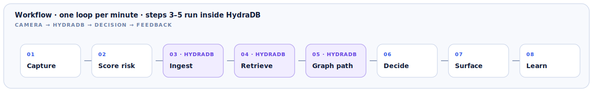
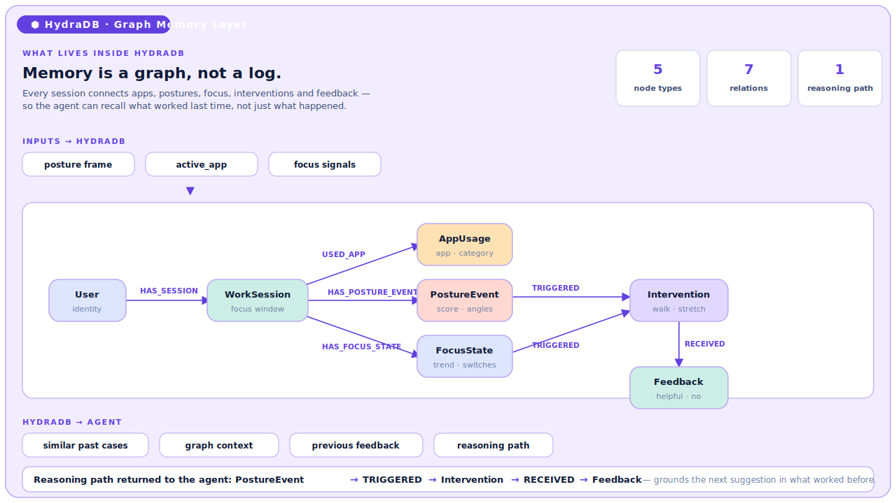

# Desktop Wellness Agent

> An agent that looks after your wellbeing while you work — and learns what restores you.

A desktop wellness agent that reads your body from your webcam, learns what actually restores your focus, and acts on it — grounded by a graph memory in **HydraDB**, so its care gets more personal every day.

## Inspiration

We spend nine to ten hours a day at a desk, and nothing actually looks after the body doing the work. The "wellness" tools that exist just nag — the same generic *"time to stand!"* for everyone, every day. They don't know you, and they remember nothing. We wanted the opposite: an agent that quietly watches over you, learns what works for you, and acts on it. **Care, not a timer.**

## What it does

Desktop Wellness Agent looks after your wellbeing while you work.

- **Sees you on-device** — reads posture, fatigue and focus from your webcam (~1/min). Images are discarded; only numbers are kept.
- **Cares, doesn't nag** — silent when you're fine; a gentle nudge (stretch, breath, or a short reset walk) when your body slumps or your focus slides. It stays quiet in meetings and backs off if you keep dismissing it.
- **Is a real agent** — it decides, acts, and learns:
  - **Learns what restores you** (a walk over a stretch; 2pm not 4pm) by closing the loop — suggest → measure recovery (posture and focus today; Apple Health HRV/HR via the planned phone companion) → converge on your personal policy.
  - **Acts** — protects a recovery window and designs the actual walking route for you.
  - **Thinks ahead** — reads your calendar, finds the moments that matter (a 3pm pitch), and works backward so your wellbeing is managed toward peak when it counts.

## How HydraDB powers it (Memory / Context)

**Memory is a graph, not a log.** In HydraDB we connect every `WorkSession`, `PostureEvent`, `FocusState`, `Intervention` and `Feedback`. Before the agent speaks, it recalls *what worked* — not just what happened — and gets back a reasoning path (`PostureEvent → Intervention → Feedback`) that grounds the next suggestion in evidence, not a guess. Every accepted or dismissed nudge flows back into the graph, so the care **compounds** and gets more personal each day. Without this memory, it's just another generic reminder.

## The data moat

It fuses signals no consumer product sees together — your **body** (camera), your **goals** (calendar), and, with the upcoming phone companion, your **biometrics** (Apple Health) — into one model of how you actually perform.

## How we built it (shipped)

- **Desktop** — Electron (transparent, always-on-top HUD overlay) + Vite + React + TypeScript
- **Perception** — MediaPipe Pose (on-device posture) + Claude vision (sparse fatigue / complexion reads)
- **Reasoning** — Nebius LLM
- **Memory** — HydraDB graph memory (recall + learn loop)
- **Context** — Google Calendar + Google Places / Directions (route design)

## Challenges

- Making triggers genuinely helpful and never annoying — getting suppression (meetings, flow, cooldowns) and receptivity-learning right.
- Honest closed-loop framing: it's a per-person personalization heuristic, not rigorous causal proof.
- Privacy: making on-device, frames-discarded perception real and visible.

## Accomplishments

- An agent that **decides, acts, and learns** — not just a suggester.
- HydraDB as **load-bearing graph memory** that returns a reasoning path.
- **On-device perception with images discarded** — privacy-first by design.

---

## The loop in detail

The rest of this README walks through that loop — what the camera sees, how each minute lands in HydraDB, and the reasoning path the graph hands back.

### Posture scoring in action — what steps 01–02 look like

The clip below is the camera + pose-estimation step running on a MacBook.
The visible overlay (face / shoulder landmarks) is what the agent *sees*;
in the background each frame is silently reduced to one integer in `0–100`
and that score — plus the active app and focus signals — is what gets
pushed into HydraDB at step **03 Ingest** every minute.

https://github.com/user-attachments/assets/c6168629-4de0-42fe-adff-1f9e8029a6da

The score is the sum of **10 indicators**, each scored from 0 to 10:

- Face visible
- Shoulder line
- Horizontal center
- Head height
- Camera distance
- Head tilt
- Neck load
- Screen focus
- Movement
- Recent trend

The app assumes a built-in front camera where only the shoulders and head are
usually visible. MediaPipe Pose Landmarker provides nose, eyes, ears, and
shoulder landmarks when it can. If pose detection fails, the app falls back to
face detection or an approximate on-device image heuristic.

Straight-neck risk is an approximation, not a medical diagnosis. It is inferred
from signals that are visible from the built-in camera: the head being low,
too close to the camera, or forward relative to the shoulders when MediaPipe
world landmarks are available.

Nothing in the clip leaves the machine: the score is computed on-device, and
only the numeric score + reasons are ever sent to an LLM review endpoint
(and only when one is configured — see [LLM Review](#llm-review)).

### Workflow — one loop per minute

Steps **3–5 run inside HydraDB**.



| Step | Where | What |
| :--- | :---- | :--- |
| 01 Capture | local | camera frame + active app + focus signals |
| 02 Score risk | local | posture indicators → integer score |
| **03 Ingest** | **HydraDB** | append nodes for posture / app / focus to this session |
| **04 Retrieve** | **HydraDB** | pull similar past sessions + their interventions |
| **05 Graph path** | **HydraDB** | return one reasoning path the agent can cite |
| 06 Decide | LLM | stay silent, or pick the intervention from the path |
| 07 Surface | UI | grounded suggestion (or "you're in flow") |
| 08 Learn | HydraDB | feedback edge written back, ready for next loop |

### Where HydraDB is used — schema and memory flow

Memory is a **graph, not a log**. Sessions connect apps, postures, focus,
interventions and feedback, so the agent can recall *what worked last time*
instead of replaying *what happened*.



Inputs into HydraDB each minute:

- `posture frame` — score + neck/shoulder angles from the camera loop
- `active_app` — current foreground app and its category
- `focus signals` — focus trend, window-switch rate

Outputs HydraDB hands back to the agent:

- `similar past cases` — sessions with the same posture + app context
- `graph context` — connected session / app / intervention nodes
- `previous feedback` — what *this* user accepted before
- `reasoning path` — one explainable chain the LLM grounds its reply in

The reasoning path returned to the agent:

```text
PostureEvent → TRIGGERED → Intervention → RECEIVED → Feedback
```

### Detailed visual deck

[`hydradb-demo.html`](./hydradb-demo.html) is the full single-page deck
(hero, workflow strip, graph, behavior cards, and a 4-beat demo timeline).
Download and open it in a browser for the styled version — the diagrams
above are extracted from it.

## LLM Review

By default the app uses a local review function and sends no image data outside
the machine.

To enable an OpenAI-compatible chat review, set all of these:

```bash
export OPENAI_BASE_URL="https://api.openai.com/v1"
export OPENAI_API_KEY="..."
export OPENAI_MODEL="your-chat-model"
npm start
```

You can also use app-specific names:

```bash
export POSTURE_REVIEW_API_URL="http://127.0.0.1:8080/v1/chat/completions"
export POSTURE_REVIEW_API_KEY="..."
export POSTURE_REVIEW_MODEL="..."
npm start
```

Only numeric score data and posture reasons are sent to the review API. Webcam
frames are not sent.

## Notes

The MediaPipe pose model is stored at `assets/models/pose_landmarker_lite.task`
so demos do not need to download the model at runtime. Electron still uses
Chromium's `FaceDetector` when pose detection is unavailable. If neither pose
nor face detection is available, the app falls back to a rough on-device image
heuristic. That fallback is useful for demos, but the score is less reliable
than the pose model.

## Run

```bash
cd /Users/keisuke.a.takiguchi/Workspace/Personal/hackason-dev
npm install
npm start
```

macOS will ask for camera permission when you press `Start camera`.

## Checks

```bash
npm run check
npm test
```

`npm test` does not require Electron or camera access.
